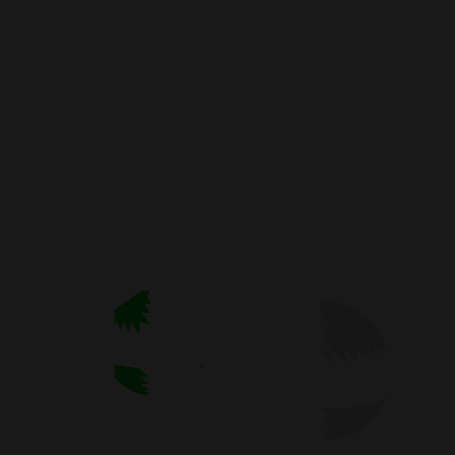
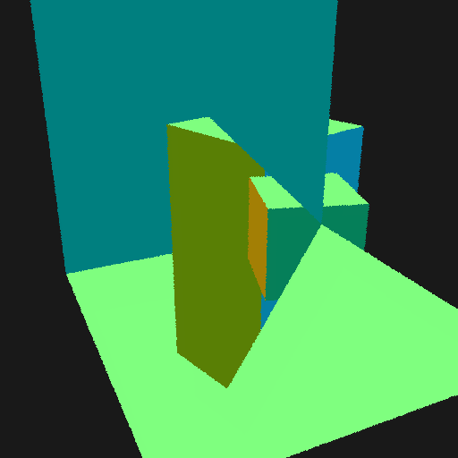
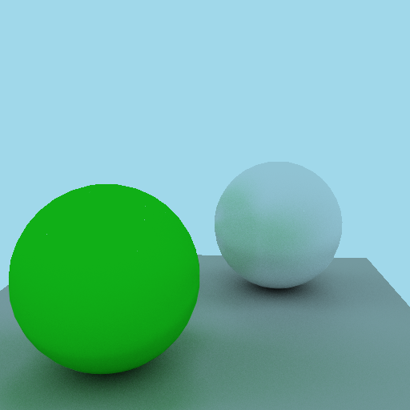
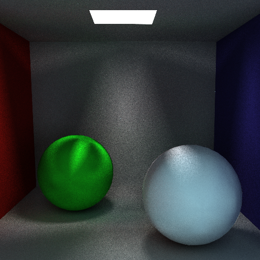
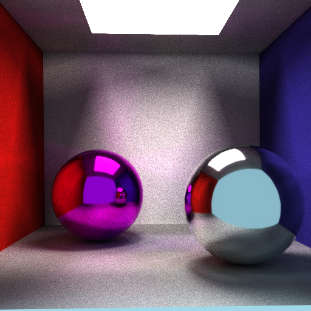
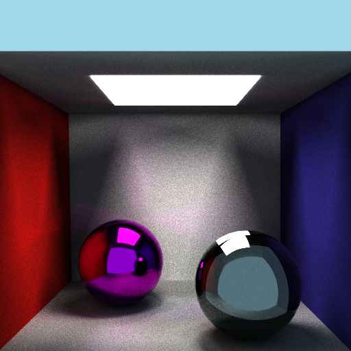
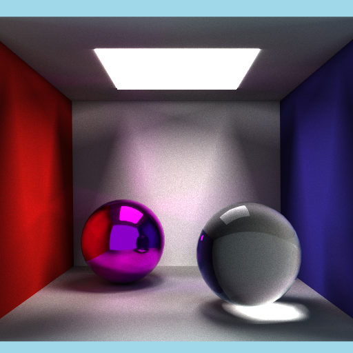
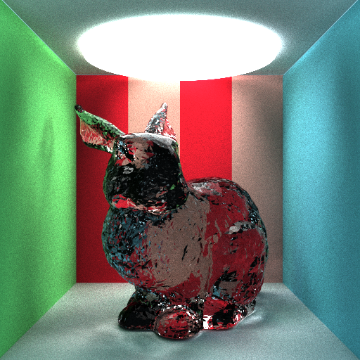
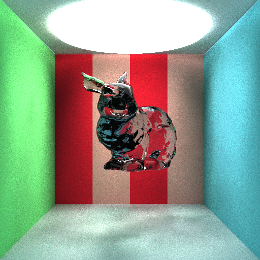
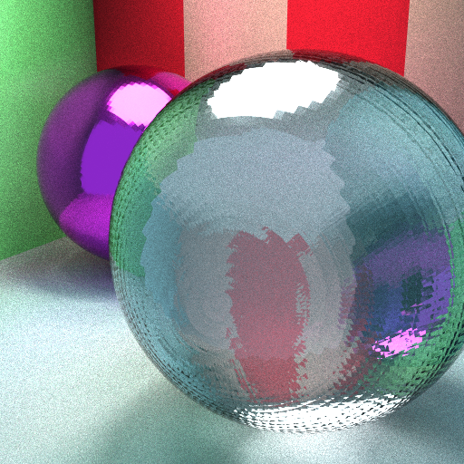

# learning from
[Drawing triangles using modern opengl](https://learnopengl.com/Getting-started/Hello-Triangle)


# journey
## How to interop cuda with opengl
yikes, I do not remember how exactly I was able to do this, what errors I faced. There were linking errors, MSVC errors, and whatnot. but I pulled through. I decided to write this after I was able to successfully run the code. I will try to write down the steps I took to get this working.

## '`GLM requires CUDA version 7.0 or higher`'
firstly I wanted to see if the kernel could actually use objects. I passed in a glm object but then the errors popped up. The code block that gives the error is at `glm/simd/platform.h`. I tried renaming the extensions of the cpp files to `.cu`, and running them with nvcc but it didn't work. Neither did defining extra preprocessor definitions like `GLM_FORCE_CUDA`.
I fixed it by removing `glm` altogether. Defined a new class by myself that works on the GPU.

## after shooting rays, the triangle is flipped in the y axis
firstly, everything was flipped. `A` went right, `D` went left. pressing `W` made the triangle smaller. but the shrinking was not uniform. i realized that even though the position of the camera was changing, the `topleft` corner vector was not. so, the fov of the rays became larger and the total percentageof the rays that hit the triangle became very low and the triangle appeared small.
then, after fixing that, i noticed that the y axis was still flipped. pageup made me go down even though printing out the position showed y is increasing. so did the mouse movement and everything else.
then, after assigning the color of the pixel according to the y values, I saw that the lower values were darker. So, I learned that **in CUDA, the y values increase from down to up. Not like traditional C indexing where the rows go from top to bottom.** 

## Next steps
- Now my program can support multiple triangles. I had this confusion about why the scene had to be a double pointer. I still don't understand it. ChatGPT is not great as a learning tool (or I just can't prompt for shit)
- load from wavefront obj files **DONE**
Today I used `tinyobjloader` to load the obj into the scene.The hardest part was to learn how to put the array of triangles and the scene data pointers to the gpu. difficulty 5/10. But I was stuck for a while just because I didn't put a semicolon in.
I loaded the `suzanne` monkey, implemented sky color and drew the surface using color from normals.
I also wrote feature for taking screenshots

## loading the Cornell box
`The cornell box` obj file that I downloaded DOES NOT HAVE VERTEX NORMALS!!! instead, they defined quads and expects me to compute the normal. How do I know if they are oriented in counter clockwise direcction or not?? I think this a valid breakdown I am going through. Nevertheless, I (or chatGPT, although incorrectly) wrote the support for those kinds of files. There was a problem with the faces having gradient colors (weird), but I was not assigning the normal to the fourth vertex. assigning that vertext normal solved it. Now on to the materials.

## Materials
To simulate physically based light scattering, I have to generate uniformly distributed random unit vectors along a hemisphere, or according to sources, where the unit vectors are distributed more along the normal. I learned about cosine weighted sampling but I am trying to learn why it is physically based and why does that calculation generate vectors along the normal more densely.
two steps:
- firstly, we sample a point on a disk.
- Then, we project that point on a unit sphere to get the final vector.
### step 1: 
we could sample two uniform RV `u`, `v`in [-1,1] and assign `r=u` and `theta=2*PI*v` to get polar coordinates $(r, \theta)$. but this will bundle the sampled points near the origin. Bcause r is being sampled uniformly, smaller values of r have the same probability of appearing as larger values of r. For the same change of theta, the points with smaller valued r will be closer together and the points with larger valued r will be further apart.
Therefore, we need to take $r = \sqrt u$, so that the smaller values of `u` are transformed further into the radius of the disk. 
### step 2: 
this is easy. since we already have an $(x, y)$ on the disk, we can get $z$ from $\sqrt{1 - x^2 - y^2}$

Next, since the hemisphere is aligned with the positive z axis, we need to transform that frame onto the surface normal. To do that, we can create an orthonormal basis with the normal as the z axis, and then scale the unit basis with the components of the random unit vector 
$$v_x \times tangent_1 + v_y \times tangent_2 + v_z \times normal$$

# Anti-aliasing
Just put some randomness into the ray direction so that it doesn't shoot the same point across frames

# loading a scene with 2000+ triangles
the cornell box with sphere scene containes 2 spheres, each with a lot of trinagles. It will take a lot of time to iterate through them all. Exactly How much time? I don't know. So let's ask ChatGPT to generate a performance logger for my code.
It will help me to see the difference in performance whenever I make any sort of upgrade to the system. Like the next one, Bounding VOlume Heirarchy

# BVH (with morton code!)
Yikes. [This video by Ten Minute Physics](https://www.youtube.com/watch?v=LAxHQZ8RjQ4) was very helpful. It showed that I can use morton codes of my triangles to sort of clump them together in terms of distance. They will be organized in a way so that I can build a BVH from them easily. But it still took me 2 days to wrap my head around with the questions in my head. What do I keep in the nodes of my bvh? i can't believe I want pointers back in my life! so, if I keep the left index of the triangle array in a node and the triangle count in a node, isn't that a waste of space? because my internal nodes don't need that information. Or does it? How does ray box intersection even work? how can I make the code GPU friendly? 
It doesn't need saying that I spiralled. 
Ok so back again to it after seeing something on instagram saying that I just need to make it exist first and make it perfect later. So, I wanna do non-consecutive children. After thinking about it for a while the code came pretty easy, but with a lot of corner cases, like:
- the `parent` being updated but the corresponding node in the array wasn't
- if the split position was the first index of the array, then the nex recursive call would have `begin == 0` and `end == -1`
- I am torn between building deeper trees vs keeping the triangles in a leaf if their morton codes are the same. Going deeper might increase the performance but will need more space.\

Now I need to code the traversal of the bvh, integrate it into my path tracer, and then try to make it CUDA friendly

okay so moment of truth!\

Something doesn't seem to be right.
so, first of all, I was calculating the morton codes wrongly
then I tried to visualize the bounding boxes using triangles as lines. Which didn't really help.
Then I noticed a few bugs in my code, where I was modifying a reference to the node object, which was not being updated in the BVH array. yikes. So I fixed that, and with a little help of Sabastian Lague, I figured out my bug in the traversal code. 
## Why we need to visit both children and not only the closest bbox?
It was pretty obvious. Lets say there are just two small trinagles in the closer leaf on the min corner and max corner only. most rays will miss the triangle and we would have to test the further bounding box for triangles intersections now don't we? My mistake was thinking the ray will always hit something in the closer bounding box.

So yeah, if we have to check both the children, a recursion would be nice. but since GPUs are not so fond of recursions, we use a stack instead 
### stackful approach vs stackless approach
One might think it is a good idea to go stackfree because stacks need extra memory. but, if we were to do that, we would need to store the index values of the nodes we have yet to visit in some other way. Well at least that is what CHatgpt said. so extra memory is always needed.
I ran into a problem. Following Sabastian Lague, i implemented the check before pushing a node('s index) onto the stack. If the ray has already found a t value that is lower than a child's t value, then all triangles in the child are farther away and do not need to be tested. so, 
`if ray.info.t < tleft` we don't push the left child onto the stack and vice versa. But somehow this was not working. 


gotta get it fixed tomorrow. but for now, the code without the test works. not wonderfully. it gets me 1 fps.
Okay so brand new day. I collapsed the bvhNode to fit into 32 bytes (for CUDA memory alignment) and it bumped the FPS from 1.0 to 1.4.
Such an improvement!
The tests that were giving me the highest performance, the early pruning of nodes, that is what was giving me trouble.
```c++
__device__
void traverseTree(bvhNode *d_BVH, Triangle *d_triangles, Ray &ray) {
    // initialize stack
    // push the root into the stack
    while (stack is not empty) {
        pop the top of the stack
        if (node is a leaf) {            
            // calculate hit with the triangles in the node
        } else {
            int32_t L = d_BVH[nodeIndex].leftChildIndex;
            float tleft = d_BVH[L].bbox.intersection_distance(ray);
            float tright = d_BVH[L + 1].bbox.intersection_distance(ray);

            if (tleft > tright) {
                if (tleft < ray.info.t) nodeIndexStack[stackPointer++] = L;~
                if (tright < ray.info.t) nodeIndexStack[stackPointer++] = L + 1;
            } else {
                if (tright < ray.info.t) nodeIndexStack[stackPointer++] = L + 1;
                if (tleft < ray.info.t) nodeIndexStack[stackPointer++] = L;
            }
        }
    }
}
```
turns out, the comparison was not working because the `t` values were not in the same unit. \
Let me explain. in my ray class, when I calculate the inverse direction (that would optimize by AABB intersection test), I put the unnormalized direction to calculate the `inv_direction` field. 
After fixing that bug, I got 86 FPS in my test scene.\



Next up, specular BRDF and Refraction

# BRDFs
Since the beginning I wanted to make a physically accurate path tracer. which means that I neeed the rays to conserve energy. So far, I knew about a number of ways to sample a direction from a BRDF. For example,
- define a fuzziness parameter for each material, scale a unit random 3D vector by the fuzziness parameter and then add it to the surface normal to get the direction of the ray
- define a fuzziness parameter and `lerp` between a diffuse direction and perfect reflection direction
I think the first one is called the Phong Model, which is not physically accurate. I am not sure about the second one. But since I am going to implent MIS later on, I think implementing pdfs is a good idea right now.  and there is a very good resource called [Crash Course on BRDFs](https://boksajak.github.io/files/CrashCourseBRDF.pdf) that helped me understand more about the microfacet model that needs pdfs too. 

One thing that my current path tracer is doing accidentally (but accurately) is when I do
`attenuation = mat.albedo`, I was actually supposed to do $$f_{diffuse} = \frac{mat.albedo \times (n \cdot w_i)}{\pi \times pdf(w_i)}$$
but since the pdf of a cosine weighted hemisphere is $\frac{cos\theta}{\pi}$, the equation simplifies to $$f_{diffuse} = mat.albedo$$

I think I have to switch from using wavefront obj models to gltf models. 

## gltf
first a little refactor here and there, rolling back the changes because it doesn't work and retrying something else later, I managed to now clean up the code a bit. 

So, basically the gltf works with nodes and there are transforamtions needed to be applied on those nodes. Since I am not using glm anymore, let's write a matrix class (but only for transformations )

## Then specular BRDF
After trying for a while, i scrapped the idea of gltf and went back to the microfacet models. I figured out the `TINY_OBJ_LOADER` already has support to parse microfacet properties. like getting the `metalness` and `roughness` from `Pm` and `Pr` in the `.mtl` file respectively. So yeah, after implementing the specular BRDF (GGX VNDF sampling to get the half vector Fresnel term for the weights) My path tracer now has smooth (and rough) mirrors!\
\
Look at em go!

## Refractions
Watching Sabastian Lague's videos has inspired me to do refractions. I mean, just imagine a glass dragon! how cool would that be? 

Fortunately, the `TINY_OBJ_LOADER` also has support to parse the `ior` value from the `.mtl` file. So, I just needed to implement the refraction BRDF. Which took me more time than I want to admit.

So apparently, refraction has a lot of cases to handle.
- Is the ray going inside a dense medium or coming out from a dense medium?
- Is the angle of incidents large enough for reflection to happen?
- Is my ray just grazing the refractive surface?

I do some vector math, run the code aaaand:\

What are these layers of reflection I am getting inside the right sphere? 

After much thought I figured out that one thing that I failed to notice was that, before refraction, I did not have to worry about *which way the surface normal was facing*. Now I do. I first modify the triangle intersection function to report true for both sides. Then I keep track of whether or not I hit the backface of the triangle inside the `ray.info` struct. If I am hitting a refractive surface and the backface is true, then I am entering a lighter medium from a dense medium (*a huge assumption. because what if my ray goes from air to water to glass to air?*). Should I keep a stack of the iors that I already passed through and pop them when I am exiting a medium? Thinking about this many cases this early into development paralyzes me. Maybe I will get over it someday. For now, let's just assume there we only enter or exit from air to one other dense medium.

Now, another subtle engineering thing we have to do is to offset the new ray origin by a small amount from the surface so that it does not intersect with the surface again due to floating point errors. Since our ray can do things other than bounce off, we should also check in which direction should we offset the origin. 

In my main render loop:
```c++
bool refracted = evalBRDF(ray.info.norm, -ray.direction, mat, &state, newdir, weight, ray.info);

float eps = refracted ? -0.001f : 0.001f;

ray.set_origin_and_direction(ray.origin + ray.direction * ray.info.t + ray.info.norm * eps, newdir);
```

and the results:\

Just look at how the light rays are getting concentrated under the glass!

Now that I can make everything into a refractive surface. It's time to go haywire. I spend the evening and night editing models in tinkerCAD (not recommended) and create some nice images:\


Well this looks swell until I see the totally flat triangluar caustics! I was assigning the face normals to all three vertices as as a fallback when there were no normals included in the `.obj` file. And what do you know, **TinkerCAD does not export obj files with smooth normals!!**

So after a bit of coding and stumbling  around, I calculated smooth normals:\

JUST LOOK AT THE CAUSTICS ON THE FLOOR!

But not generating smooth normals gave me some prett interesting results as well:


# RIS (Coming soon)


